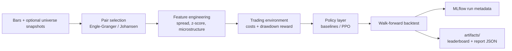

# RL Statistical Arbitrage Engine

[](https://github.com/9shrey/rl-statistical-arbitrage/actions/workflows/ci.yml)

A walk-forward research framework for pairs trading with cointegration-based pair selection, trailing-only features, transaction-cost-adjusted backtests, baseline policies, and optional PPO evaluation.

This is a research/backtesting project, not a live trading system. It is built to make implementation claims inspectable in code and tests.

## What It Does

- Selects candidate pairs with Engle-Granger, Johansen, return correlation, sample-size, and half-life filters.
- Builds rolling hedge ratios and z-scores using trailing windows only.
- Runs walk-forward backtests with pair selection performed on each training window only.
- Models commission, half-spread slippage, and simple linear market impact.
- Compares buy-hold spread exposure, static z-score, grid-search z-score, and PPO when enabled.
- Generates a leaderboard with total return, annualized return/volatility, Sharpe, Sortino, Calmar, max drawdown, turnover, trades, transaction costs, and final equity.
- Supports fixture-backed point-in-time universe snapshots for tests and local experiments.
- Optionally logs configs, selected pairs, metrics, leaderboard artifacts, and equity hashes to MLflow.

## Architecture



| Layer | Implementation |
|---|---|
| Data | Fixture/CSV/yfinance loaders, aligned OHLCV bars |
| Universe | Optional effective-dated snapshot CSV via `arb.data.universe.universe_at` |
| Pair selection | `arb.signals.cointegration` Engle-Granger, Johansen, half-life scoring |
| Features | Rolling hedge ratio, spread, z-score, realized volatility, bid-ask proxy |
| Regime features | HMM/Gaussian mixture fit on train folds; online-style state prediction |
| Environment | Custom discrete Gymnasium-compatible pairs-trading env |
| Policies | Buy-hold, static z-score, grid z-score, PPO |
| Reporting | Markdown leaderboard, JSON report, optional MLflow logging |

## Implemented vs Future Work

Implemented:

- Discrete action environment: flat, long spread, short spread.
- PPO via Stable-Baselines3 on the discrete environment.
- Train-window-only cointegration pair selection.
- Fixture-backed point-in-time universe snapshots.
- Transaction-cost-adjusted fold metrics and leaderboard reports.
- Optional local MLflow logging behind `mlflow.enabled: true`.

Future work:

- SAC requires a separate continuous `Box([-1, 1])` target-exposure environment and is not implemented here.
- Real survivorship-bias control depends on high-quality historical index membership and delisting data. The repo includes a fixture-backed PIT mechanism, not a complete vendor-grade universe database.
- yfinance data is convenient for demos but not institutional research data.

## How To Run

```bash
python -m pip install -U pip
python -m pip install -e ".[dev,stats,rl,viz,data]"

make test
make smoke
make report CONFIG=configs/smoke.yaml
```

Optional PPO smoke run:

```bash
make report CONFIG=configs/fast_rl.yaml
```

Longer research-style run using downloaded daily bars:

```bash
make report CONFIG=configs/full.yaml
```

## Research Rigor

- Trailing-only rolling hedge ratios and z-scores.
- Walk-forward validation with expanding train windows and fixed test windows.
- Pair selection is repeated per fold using training prices only.
- Optional universe snapshots are resolved as of the fold training start.
- HMM/regime models are fit on train data only and not refit on test folds.
- Baselines are reported alongside PPO rather than hidden.
- Metrics are transaction-cost-adjusted.
- Tests cover no-look-ahead signals, pair-selection leakage boundaries, cost effects, config validation, regime no-refit behavior, deterministic smoke runs, and report contents.

## Limitations

- Not financial advice.
- No live trading, broker integration, order management, or production risk system.
- Fixture PIT snapshots prove the mechanism; they are not a complete historical equity universe.
- Backtests can still suffer from survivorship bias if the point-in-time universe inputs are replaced with naive ticker lists.
- RL policies are unstable across seeds and can overfit small walk-forward windows.
- yfinance bars may contain adjustments, missing data, and vendor quirks.
- PPO may fail to beat simple z-score baselines; the report states the result instead of assuming outperformance.
- SAC is intentionally excluded until a continuous-action environment is implemented and tested.

## Useful Files

- `src/arb/signals/cointegration.py` - cointegration tests and pair selection
- `src/arb/backtest/engine.py` - walk-forward execution
- `src/arb/report/leaderboard.py` - leaderboard rendering
- `configs/smoke.yaml` - fast fixture run
- `configs/fast_rl.yaml` - tiny PPO comparison run
- `docs/resume_bullets.md` - safe resume wording

Keywords: statistical arbitrage, pairs trading, cointegration, PPO, Gymnasium, HMM, walk-forward validation, transaction costs, Sharpe, Sortino, Calmar.
